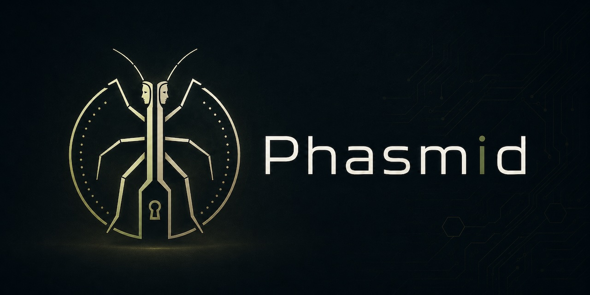

# Phasmid



Phasmid is a field-evaluation prototype for local-only coercion-aware storage.

It is the reference implementation of the Janus Eidolon System, a two-slot local storage architecture designed to separate visible disclosure from protected local state under practical risks such as device seizure, compelled access, and over-disclosure.

Phasmid is research software. It is not a replacement for full-disk encryption, hardware-backed key storage, an audited classified-data handling system, or a complete solution to compelled disclosure.

## What It Does

- Creates an encrypted `vault.bin` container.
- Stores protected entries in an internal two-slot container model.
- Provides a coercion-safe delaying architecture with Silent Standby (`active` / `standby` / `sealed` / `dummy_disclosure`), preconfigured disclosure-support content workflows, and local plausibility checks.
- Uses object-image matching with ORB as an operational access cue.
- Can optionally evaluate an experimental lightweight local object model behind a feature flag.
- Encrypts payloads with AES-GCM and Argon2id-derived keys.
- Mixes a local access key into recovery so `vault.bin` alone is not enough.
- Supports normal access and restricted recovery behavior.
- Provides a CLI and a local WebUI v2.
- Provides owner-controlled restricted actions that can clear local state.
- Includes metadata risk check workflows for metadata-reduced copy review.
- Metadata detection and reduction are best-effort.

Phasmid does not promise perfect deniability. It reduces operational damage in some compelled-access scenarios by separating access conditions, local state, physical-object cues, and restricted recovery behavior.

## Security Claims and Non-Claims

Phasmid separates four concepts that are often conflated:

- Software existence concealment: Phasmid does not claim this.
- Data-existence deniability: partial and scenario-dependent.
- Controlled disclosure: primary project claim.
- Coercion-aware fallback behavior: operational goal.

Phasmid claims:

- separation of protected local state from coerced-disclosure output paths;
- passphrase-based controlled disclosure of a specified local entry;
- local-only operation by default, with WebUI bound to `127.0.0.1` unless explicitly changed;
- reduced dependence on `vault.bin` alone through mixed local key material.

Phasmid does not claim:

- hiding the existence of the software from a capable forensic examiner;
- perfect deniability under all adversary models;
- guaranteed secure deletion on flash media;
- protection against live memory capture, compromised hosts, or keyloggers;
- forensic immunity of any kind.

Tool discovery, repository discovery, process logs, shell history, and host artifacts can weaken operational deniability. Discovery of Phasmid does not by itself prove the existence of additional undisclosed data, but it does narrow ambiguity and should be treated as an operational risk.

## Philosophy

Phasmid follows a simple rule: no lies, no unnecessary truth.

The interface should report what the user needs to complete the current operation, but it should not reveal the internal disclosure model, storage structure, trial order, or restricted recovery behavior.

Honest interface. Silent structure.

Phasmid is not field-proven until it has been validated on target hardware with the Field Test Procedure and Seizure Review Checklist.

## When to Use Phasmid

Use Phasmid when the problem is not merely file encryption, but compelled access, device seizure, over-disclosure, metadata risk, or local UI/log leakage.

If your only requirement is normal file encryption on a trusted device, a mature full-disk encryption system, password manager, or audited file-encryption tool may be more appropriate.

Phasmid is intentionally specialized. It is not designed to be the simplest way to encrypt files.

## From Prototype to Solution

Phasmid should not become a stronger product by claiming more. It becomes stronger by making its operating boundary repeatable, testable, and boring.

The path from field-evaluation prototype to operational solution is:

1. keep the scope local-only;
2. keep the interface quiet under capture;
3. provide a reproducible appliance deployment;
4. complete target-hardware field testing;
5. complete seizure-review testing;
6. record validation results for each release;
7. publish only claims that are covered by tests or documented limits.

Run the WebUI in Field Mode by setting `PHASMID_FIELD_MODE=1`. Field Mode reduces normal exposure in capture-visible workflows, but Field Mode is not a security boundary.

Until those validation gates are completed on target hardware, Phasmid should be described as a field-evaluation prototype. After those gates are completed and recorded, it can be described as a local coercion-aware storage appliance for the validated deployment conditions.

The Raspberry Pi Zero 2 W remote SSH field-test harness implementation is tracked in GitHub issues `#89` through `#94`, and runnable scripts are available under `scripts/pi_zero2w/`. Harness availability is not itself evidence that target-hardware validation has been completed.

## Hardware Form Factor Boundary

Current Phasmid hardware is an evaluation prototype, not a hostile-inspection-ready field form factor.

Evaluation prototype (current):

- Raspberry Pi Zero 2 W-based build;
- visible camera module and development-oriented wiring may be present;
- intended for development, benchmarking, protocol validation, and controlled operator training.

Future field form factor (not solved in current codebase):

- benign external appearance appropriate to operating context;
- no visually obvious camera/security-hardware signal;
- possession plausibility and interaction pattern that do not attract unnecessary inspection.

This distinction is operational, not cosmetic. Validation on Raspberry Pi Zero 2 W does not by itself solve physical plausibility under hostile inspection.

## Safe Use Boundary

Phasmid is intended for lawful local protection of sensitive material where device seizure, compelled access, or over-disclosure are realistic risks.

It is appropriate for:

- source-protection workflows,
- temporary field notes,
- research material,
- travel-sensitive files,
- local-only controlled disclosure experiments,
- defensive security research.

It is not intended for:

- covert communication,
- surveillance evasion,
- censorship bypass,
- remote wipe,
- remote unlock,
- offensive operations,
- malware storage,
- illegal concealment,
- replacing organizational classified-data systems.

## Government and Organizational Use Boundary

Phasmid is not approved classified-data handling infrastructure. It does not replace organizational records-management systems, certified encryption products, HSM-backed key management, full-disk encryption, or formal classified-data procedures.

Use of Phasmid in government or organizational environments must follow applicable law, policy, records-retention requirements, and classification rules. Phasmid is intended for local field-evaluation and harm-reduction workflows, not as a substitute for approved systems of record.

## Storage Encryption (LUKS Layer)

Phasmid supports an optional LUKS2 storage layer for local container and state paths.
This layer can reduce offline filesystem exposure by encrypting the underlying block
storage until mapped and mounted. It does not replace Phasmid's local-only posture,
and it does not provide protection against compromised hosts, live memory capture,
or keylogging. Erase-related actions in this layer remain best-effort.

See [`docs/LUKS_LAYER.md`](docs/LUKS_LAYER.md) for threat-model limits, operating
procedure, and deployment notes. This layer is not a replacement for full-disk
encryption on a trusted platform.

## Reviewer Notes and Known Limits

Phasmid is intentionally narrow.

Configuration reference:

- [`docs/CONFIGURATION.md`](docs/CONFIGURATION.md) — authoritative reference for `PHASMID_*` environment variables
- Common examples: `PHASMID_FIELD_MODE`, `PHASMID_MIN_PASSPHRASE_LENGTH`, `PHASMID_ACCESS_MAX_FAILURES`, `PHASMID_ACCESS_LOCKOUT_SECONDS`
- Experimental object gate: `PHASMID_EXPERIMENTAL_OBJECT_MODEL=1` enables a local-only secondary object-gate path. It is disabled by default and does not affect key derivation.
- Model provisioning is explicit. Phasmid does not auto-download models during normal startup or access attempts.

Experimental model fetch flow:

```bash
python3 scripts/fetch_object_model.py
export PHASMID_OBJECT_MODEL_PATH="$PWD/models/object_gate/mobilenet_v2_1.0_224_feature_vector.tflite"
export PHASMID_EXPERIMENTAL_OBJECT_MODEL=1
```

Threat model and security review documents:

- [`docs/THREAT_MODEL.md`](docs/THREAT_MODEL.md) — authoritative threat model (adversaries, assets, attack surfaces, threat scenarios, non-goals)
- [`docs/COERCION_SAFE_DELAYING.md`](docs/COERCION_SAFE_DELAYING.md) — coercion-safe delaying architecture (standby and disclosure-support workflow)
- `docs/THREAT_ANALYSIS_STRIDE.md` — full STRIDE analysis cross-referencing the threat model
- [`docs/CLAIMS.md`](docs/CLAIMS.md) — inventory of project claims with verification status
- [`docs/NON_CLAIMS.md`](docs/NON_CLAIMS.md) — explicit non-claims and rationale
- [`docs/KEY_LIFECYCLE.md`](docs/KEY_LIFECYCLE.md) — key-material lifecycle audit summary and persistence boundaries
- [`SECURITY.md`](SECURITY.md) — vulnerability disclosure policy
- [`CONTRIBUTING.md`](CONTRIBUTING.md) — contribution scope, claim, and review discipline
- [`docs/BUS_FACTOR.md`](docs/BUS_FACTOR.md) — maintainer continuity note
- [`docs/REPRODUCIBLE_BUILDS.md`](docs/REPRODUCIBLE_BUILDS.md) — reproducible release-review artifact procedure
- [`docs/DEPENDENCIES.md`](docs/DEPENDENCIES.md) — dependency pinning and update policy
- [`docs/VERSIONING.md`](docs/VERSIONING.md) — versioning and compatibility policy
- [`docs/OBJECT_CUE_LIGHTWEIGHT_AI_REEVALUATION.md`](docs/OBJECT_CUE_LIGHTWEIGHT_AI_REEVALUATION.md) — offline lightweight AI re-evaluation plan for object-cue matching
- [`CHANGELOG.md`](CHANGELOG.md) — release history and security-impact notes

Operational review and deployment guidance can be found in:

- `docs/SOURCE_SAFE_WORKFLOW.md`
- `docs/SEIZURE_REVIEW_CHECKLIST.md`
- `docs/FIELD_TEST_PROCEDURE.md`
- `docs/REVIEW_VALIDATION_RECORD.md`
- `docs/SOLUTION_READINESS_PLAN.md`
- `docs/JANUS_EIDOLON_SYSTEM.md`
- `docs/PHASMID_ARCHITECTURE.md`
- `docs/OPERATIONS.md`
- `docs/RESTRICTED_ACTIONS.md`
- `docs/STATE_RECOVERY.md`

Target-hardware validation workflow implementation for Raspberry Pi Zero 2 W is tracked in GitHub issues `#89` through `#94`. Validation remains incomplete until results are recorded in `docs/REVIEW_VALIDATION_RECORD.md`.

This README is part of the authoritative appliance deployment guide and review workflow. Release Review Artifacts are generated by the CI pipeline to support review. This is not a validated cryptographic-module certification.

### Release Review Artifacts (Issue #16)

Generate a local review bundle with a checksum manifest and CycloneDX SBOM:

```bash
python3 scripts/generate_release_artifacts.py --output-dir release/local --archive
```

If you need a signed manifest for release review, provide an Ed25519 private key PEM:

```bash
python3 scripts/generate_release_artifacts.py \
  --output-dir release/local \
  --archive \
  --signing-key ./release-signing-private.pem
```

This writes `MANIFEST.sha256`, `sbom.cyclonedx.json`, `release-summary.json`, and `MANIFEST.sha256.sig` when signing is enabled.

Phasmid non-claims are maintained in:

- [`docs/NON_CLAIMS.md`](docs/NON_CLAIMS.md)

## Repository Layout

```text
.
├── main.py                  # Local CLI launcher
├── src/phasmid/            # Application package
│   ├── cli.py              # CLI entry point — routes to TUI by default
│   ├── vault_core.py
│   ├── ai_gate.py
│   ├── web_server.py
│   ├── tui/                # TUI Operator Console (textual)
│   │   ├── app.py
│   │   ├── banner.py
│   │   ├── theme.py
│   │   ├── screens/        # Home, Audit, Doctor, Guided, Inspect, ...
│   │   └── widgets/        # VesselTable, VesselSummaryPanel, EventLog, WarningBox
│   ├── services/           # Service layer (vessel, doctor, audit, guided, ...)
│   ├── models/             # Data models (VesselMeta, DoctorResult, AuditReport, ...)
│   └── templates/
├── docs/                    # Specification and threat model
├── scripts/                 # Utility scripts
├── tests/                   # Unit tests
└── requirements.txt
```

Runtime files such as `vault.bin`, `.state/`, and audit logs are intentionally ignored by Git.

## Install

For normal repository-local use, start with:

```bash
./phasmid
```

The repo wrapper creates `.venv` on first use if needed, installs dependencies
into that environment if the local `phasmid` entrypoint is missing, and then
launches the TUI. This is the recommended path for both first run and later
runs inside this repository.

If you need to manage the virtual environment manually, use:

```bash
python3 -m venv .venv
source .venv/bin/activate
pip install -r requirements.txt
pip install -e .
```

That manual path installs the local `phasmid` command into the active virtual
environment so `phasmid --help` and the CLI subcommands work as documented.

## TUI Operator Console

### What is a Vessel?

In Phasmid, a **Vessel** is a headerless deniable container file. It carries one or more disclosure faces without exposing metadata, magic bytes, or an obvious vault structure.

### Starting the TUI

```bash
./phasmid
```

Running `phasmid` with no arguments opens the Main Operator Console.

```text
┌─ PHASMID : JANUS EIDOLON SYSTEM ───────────────────────────┐
│ coercion-aware deniable storage                             │
│ one vessel / multiple faces / no confession                 │
├───────────────────────┬─────────────────────────────────────┤
│ Vessels               │ Vessel Summary                      │
│ Deniable containers   │                                     │
│                       │ Name          travel.vessel          │
│ > travel.vessel       │ Size          512.0 MiB              │
│   archive.vessel      │ Header        absent                 │
│   field-notes.vessel  │ Magic Bytes   absent                 │
│                       │ Faces         unknown                │
│                       │ Posture       operational            │
├───────────────────────┴─────────────────────────────────────┤
│ o Open  c Create  i Inspect  f Faces  g Guided  a Audit … q │
└─────────────────────────────────────────────────────────────┘
```

### TUI Commands

| Command | Description |
|---|---|
| `phasmid` | Open the Main Operator Console |
| `phasmid open <vessel>` | Open a Vessel |
| `phasmid create <vessel>` | Create a new Vessel |
| `phasmid inspect <vessel>` | Inspect a Vessel |
| `phasmid guided` | Open Guided Workflows |
| `phasmid audit` | Open Audit View |
| `phasmid doctor` | Run Doctor checks |
| `phasmid doctor --no-tui` | Print Doctor output without TUI |

### Keyboard Shortcuts

| Key | Action |
|---|---|
| `o` | Open selected Vessel |
| `c` | Create new Vessel |
| `i` | Inspect selected Vessel |
| `f` | Manage Faces |
| `g` | Guided Workflows |
| `a` | Audit View |
| `d` | Doctor |
| `s` | Settings |
| `?` | Help / About |
| `q` | Quit |

### Guided Workflows

Guided Workflows are step-by-step interactive explanations for education, demonstrations, and operator onboarding. They are accessible from the main console (`g`) or directly:

```bash
phasmid guided
```

Available workflows:

- **Coerced Disclosure Walkthrough** — Step through a compelled-disclosure scenario.
- **Headerless Vessel Inspection** — See what an external observer finds when inspecting a Vessel.
- **Multiple Disclosure Faces** — Walk through the concept of multiple disclosure faces.
- **Operator Safety Checklist** — Review operational controls and known risks.

### Audit View

Audit View shows system position, cryptographic controls, operational controls, logging policy, known limitations, and non-claims. It exists to make Phasmid reviewable by security researchers, government-adjacent evaluators, and institutional stakeholders.

```bash
phasmid audit
```

### Doctor View

Doctor View runs structured local risk checks on the operator's environment.

```bash
phasmid doctor
```

Checks include: configuration directory permissions, shell history risk, temporary directory policy, secure randomness availability, swap status (best effort), terminal scrollback notice, and debug logging status.

> This check reduces obvious mistakes. It does not certify the host as secure.

### Security Limitations

Phasmid is a **research-grade prototype**. It does not claim:

- deniability that is forensically unverifiable
- operation that is coercion-proof
- storage that is undetectable
- encryption that is unbreakable
- operation that is guaranteed safe

Deniability is procedural and depends on operational context. Host compromise may defeat confidentiality. OS artifacts may reveal usage. Coercion resistance is not absolute.

Brick and restricted-clear actions are logical access-destruction mechanisms (key-path invalidation plus best-effort overwrite). They are not physical media sanitization guarantees on flash storage.

---

## CLI Usage

Initialize a container:

```bash
phasmid init
```

Store a file:

```bash
phasmid store --entry a --file path/to/file
phasmid store --entry b --file path/to/file
```

The CLI keeps a compact entry selector. The WebUI uses neutral entry-based language and does not expose the internal storage model during normal operation.

Retrieve a file:

```bash
phasmid retrieve --out output.bin
```

Clear the local access path:

```bash
phasmid brick
```

Local operations checks:

```bash
phasmid verify-state
phasmid verify-audit-log
phasmid doctor
phasmid export-redacted-log --out review-events.jsonl
```

These commands report neutral readiness and audit-review status without printing local paths in normal output.

New local state checks use a typed state-store helper for atomic writes, restrictive permissions, and transition validation. Existing vault and object-cue state files remain managed by their owning modules until a documented state migration replaces them.

When audit logging is enabled, new audit records include sequence and integrity fields for local review. Audit logging remains disabled by default because audit records can create additional local metadata.

## WebUI v2

The local WebUI is managed directly through the TUI Operator Console (press `w`
to start/stop). This is the recommended method as it includes an **Auto-Kill
Timer** that automatically terminates the WebUI after 10 minutes of TUI
inactivity.

To start the WebUI manually:

```bash
PYTHONPATH=src python3 -m phasmid.web_server
```

Open `http://127.0.0.1:8000`.

WebUI v2 uses neutral entry-based terminology. Normal screens do not show internal storage labels, retrieval order, or restricted local-state behavior.

Common WebUI/API wording is centralized where practical so terminology checks can audit capture-visible messages consistently.

## Test Command

```bash
python3 -m unittest discover -s tests
python3 -m black --check src tests scripts
python3 -m bandit -r src
```

Static check commands:

```bash
python3 -m black --check src tests scripts
python3 -m bandit -r src
```

Coverage command:

```bash
python3 -m coverage run --source=src -m unittest discover -s tests
python3 -m coverage report -m
```

Alternative short coverage command:

```bash
coverage run -m unittest discover -s tests
coverage report
```

Release Review Artifacts are generated by the CI pipeline and support review of the current branch.

Passing automated tests do not prove field safety. They verify expected local behavior and regression boundaries only.

## License

Phasmid is licensed under the Apache License, Version 2.0. See [LICENSE](LICENSE).

Third-party dependency licenses are listed in [THIRD_PARTY_LICENSES.md](THIRD_PARTY_LICENSES.md).

Phasmid is research software. The license grants software-use rights; it does not imply operational approval, field validation, classified-data handling approval, or suitability for any specific deployment.
