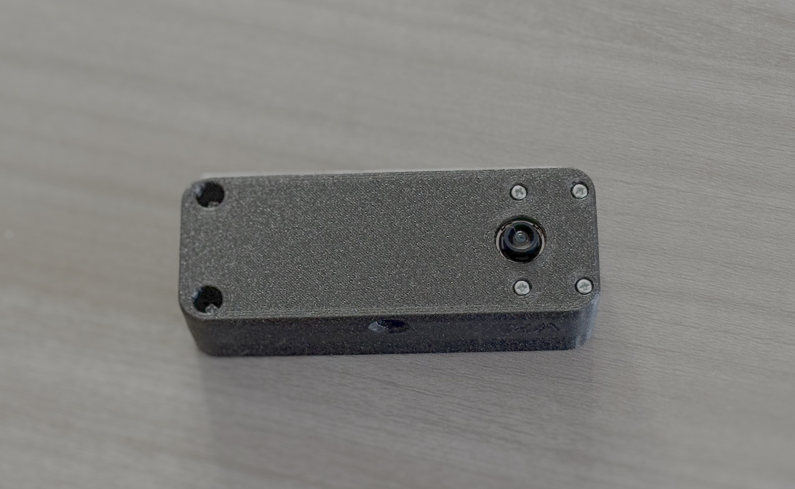
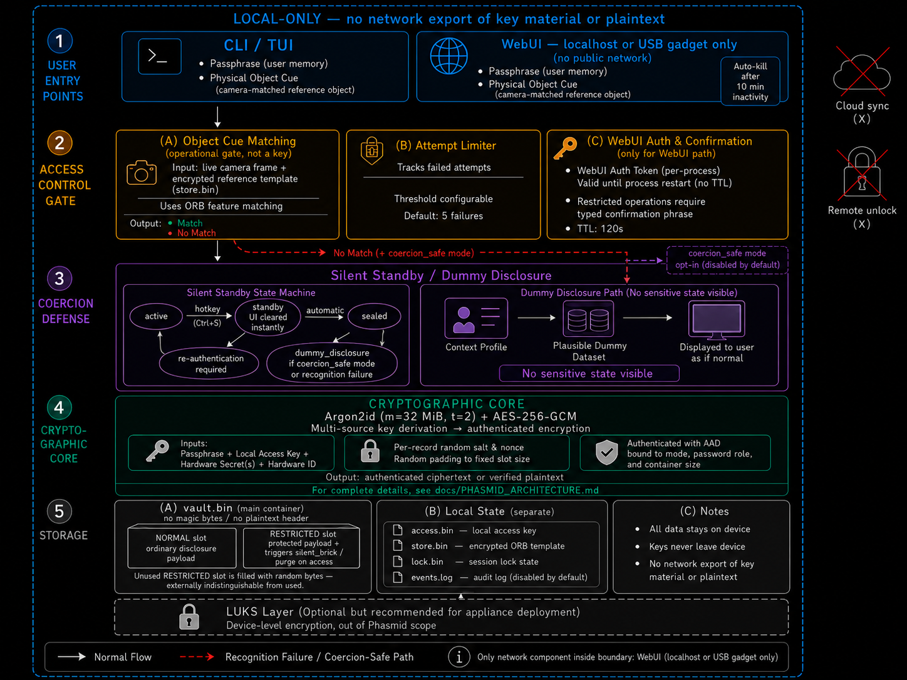

# Phasmid


[](https://github.com/01rabbit/Phasmid/actions/workflows/ci.yml)
[](https://www.python.org/)
[](LICENSE)
[](https://github.com/psf/black)
[](https://github.com/astral-sh/ruff)
[](https://mypy-lang.org/)
[](https://github.com/PyCQA/bandit)
[](docs/CLAIMS.md)
[](docs/THREAT_MODEL.md)
[](SECURITY.md)

Phasmid is a field-evaluation prototype for local-only coercion-aware storage. It is the reference implementation of the Janus Eidolon System, a two-slot local storage architecture designed to separate visible disclosure from protected local state under practical risks such as device seizure, compelled access, and over-disclosure.

Phasmid is research software. It is not a replacement for full-disk encryption, hardware-backed key storage, an audited classified-data handling system, or a complete solution to compelled disclosure.

**Who this is for:** security researchers, field-risk evaluators, and local-only disclosure-control experiments. It is not for casual file encryption.

## Requirements

| Requirement | Detail |
|---|---|
| Python | 3.10 or later |
| OS | Linux, macOS (development); Raspberry Pi OS Bookworm/Bullseye (deployment) |
| Hardware | x86-64 laptop/desktop for development; Raspberry Pi Zero 2 W for field deployment |
| Camera (optional) | Picamera2 / libcamera — required only for object-cue matching on Pi |
| WebUI (optional) | Any modern browser; intended for localhost or USB gadget Ethernet access only |
| LUKS (optional) | Linux kernel with dm-crypt — required for the optional LUKS2 storage layer |

For Raspberry Pi deployment, `python3-picamera2` and `python3-libcamera` must be installed via apt before running the bootstrap script.

## Hardware Snapshot




## Quick Start in 60 seconds

```bash
git clone https://github.com/01rabbit/Phasmid.git
cd Phasmid
./phasmid
```

What `./phasmid` does on first run:

- creates `.venv` if needed
- installs project dependencies
- opens the TUI Operator Console

Success check:

- you see the TUI Operator Console panel
- press `c` to create a Vessel
- press `g` for a guided walkthrough

If the TUI does not open, run `phasmid doctor`.

## Architecture Overview



> Quick legend:
> - **Vessel**: local container carrying multiple Disclosure Faces
> - **Object cue**: operational access gate, not cryptographic key material
> - **Restricted slot**: triggers irreversible local-state destruction on access
>
> Full cryptographic parameters and storage layout:
> [docs/PHASMID_ARCHITECTURE.md](docs/PHASMID_ARCHITECTURE.md)

Access flow, two-slot storage, coercion defense, and local-only boundary are documented in [`docs/PHASMID_ARCHITECTURE.md`](docs/PHASMID_ARCHITECTURE.md).

## What Phasmid does

- creates and operates encrypted local containers (`vault.bin`)
- uses Argon2id-derived keys and AES-GCM authenticated encryption
- mixes local key material into recovery so `vault.bin` alone is insufficient
- supports local CLI, TUI Operator Console, and optional local WebUI
- enforces restricted local actions with explicit confirmation
- provides metadata-risk review and metadata-reduction workflows (best effort)

## Security boundary summary

Phasmid claims:

- local-only operation by default
- controlled disclosure behavior under documented conditions
- reduced dependence on `vault.bin` alone through mixed local key material

Phasmid does not claim:

- perfect deniability
- guaranteed secure deletion
- protection against compromised hosts, keyloggers, or live memory capture
- covert communication, censorship bypass, remote wipe, or remote unlock

For complete claims and non-claims, see [`docs/CLAIMS.md`](docs/CLAIMS.md), [`docs/NON_CLAIMS.md`](docs/NON_CLAIMS.md), and [`docs/THREAT_MODEL.md`](docs/THREAT_MODEL.md).

## Install and run details

For normal repository-local use:

```bash
./phasmid
```

If you need a manual environment setup:

```bash
python3 -m venv .venv
source .venv/bin/activate
pip install -r requirements.txt
pip install -e .
```

Raspberry Pi bootstrap:

```bash
./scripts/bootstrap_pi.sh
source .venv/bin/activate
./scripts/validate_pi_environment.sh
```

## Common commands

```bash
phasmid                # open TUI Operator Console
phasmid doctor         # local environment checks
phasmid guided         # guided workflows
phasmid audit          # audit view
python3 -m unittest discover -s tests
```

## Documentation map

Primary entry points:

- Documentation index (full map): [`docs/README_INDEX.md`](docs/README_INDEX.md)
- Threat model authority: [`docs/THREAT_MODEL.md`](docs/THREAT_MODEL.md)
- Behavioral specification: [`docs/SPECIFICATION.md`](docs/SPECIFICATION.md)
- Architecture overview: [`docs/PHASMID_ARCHITECTURE.md`](docs/PHASMID_ARCHITECTURE.md)

## Repository layout

```text
.
├── main.py                  # Local CLI launcher
├── src/phasmid/            # Application package
│   ├── cli.py              # CLI entry point
│   ├── vault_core.py
│   ├── ai_gate.py
│   ├── web_server.py
│   ├── tui/                # TUI Operator Console (textual)
│   ├── services/           # Service layer
│   ├── models/             # Data models
│   └── templates/
├── docs/                   # Specification and threat model
├── scripts/                # Utility scripts
├── tests/                  # Unit tests
└── requirements.txt
```

Runtime files such as `vault.bin`, `.state/`, and audit logs are intentionally ignored by Git.
